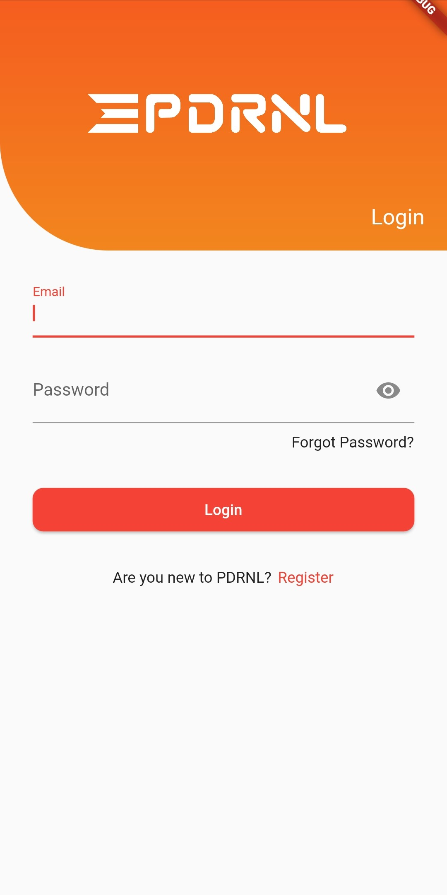

# 🏆 PDRNL Events App

  

An application with which you can register for drone racing competitions, linked to the PDRNL system.

- Flutter version: 3.3.x
- Dart version: 2.18.x

## Packages

The following packages are used in this project:

- [provider](https://pub.dev/packages/provider)
- [http](https://pub.dev/packages/http)
- [flutter_dotenv](https://pub.dev/packages/flutter_dotenv)
- [shared_preferences](https://pub.dev/packages/shared_preferences)
- [device_info_plus](https://pub.dev/packages/device_info_plus)

## Getting Started

This project is a starting point for a Flutter application.

A few resources to get you started if this is your first Flutter project:

- [Lab: Write your first Flutter app](https://docs.flutter.dev/get-started/codelab)
- [Cookbook: Useful Flutter samples](https://docs.flutter.dev/cookbook)

For help getting started with Flutter development, view the
[online documentation](https://docs.flutter.dev/), which offers tutorials,
samples, guidance on mobile development, and a full API reference.
